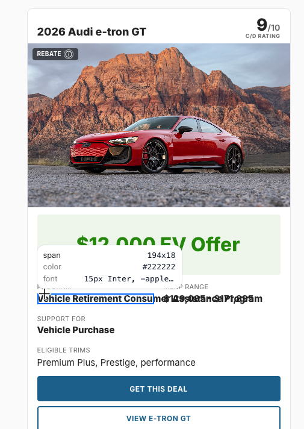

# EV Incentive Experience — Change Report

Date: September 10, 2026 
Environment: Local development (`http://localhost:5173`)

## Visual verification

The following views were captured from the active local browser and reviewed against the product-manager feedback. The numbered callouts correspond to the highlighted areas shown during review.

### 1. EV Incentive front cards

Page: [Filtered EV incentives](http://localhost:5173/deals/ev-incentives?make=Audi&model=e-tron+GT&fuelType=Electric)

Before — the supplied QA screenshot showing the overlap:

Callouts:

1. The green payment area now presents a single offer amount, such as `$12,000 EV Offer` or `$100 EV Offer`.
2. The program name is displayed below the offer and uses a full-width row, preventing the overlap reported by QA.
3. MSRP Range and Support For remain separate fields below the program name.
4. Eligible Trims remains visible above the CTAs.
5. Rebate and Bill Credit badges include informational tooltips.

After verification was captured in the local browser: the Program field now occupies its own row and no longer collides with MSRP Range.

### 2. EV incentive offer modal

Open the modal by selecting `GET THIS DEAL` on the filtered EV incentives page.

Callouts:

1. The modal uses the `EV OFFER` label and a single offer value, for example `$12,000 Vehicle Retirement`.
2. `WHAT IS THIS OFFER?` contains the sponsoring program description.
3. `PROGRAM RULES` contains the product-manager supplied eligibility and stacking rules.
4. `ELIGIBLE TRIMS` is displayed as its own section.
5. `DON'T WAIT TOO LONG` contains the requested urgency guidance.
6. The removed expiration and yellow eligibility treatment are not shown for the updated EV offers.

### 3. MMP vehicle-page tags

Page: [2026 Audi e-tron GT](http://localhost:5173/2026/Audi/e-tron-GT)

The `SPECIAL DEALS AND INCENTIVES` area now includes EV Offer tags for:

- `EV OFFER — $12,000 for Charging Station`
- `EV OFFER — $100 for Electricity Bill Credit`
- `EV OFFER — $12,000 for Vehicle Retirement`

These tags link back to the filtered EV incentives experience and expose the same explanatory tooltips as the cards.

## Implementation summary

- Added centralized EV presentation data in `src/services/evIncentivesService.ts`.
- Updated front-card rendering in `src/pages/EvIncentivesPage/EvIncentivesPage.tsx`.
- Added conditional expiration handling in `src/components/DealCard/DealCard.tsx`.
- Updated modal headings, offer values, rules, and conditional sections in `src/components/IncentivesModal/IncentivesModal.tsx`.
- Added MMP EV tags in `src/components/Hero/Hero.tsx` and `src/components/Hero/HeroOffersB.tsx` with supporting styles in `src/components/Hero/Hero.css`.
- Fixed the reported card overlap by making the long Program detail full width.

## Verification status

- `npm run build` — passed.
- Targeted ESLint for changed EV incentive, modal, and Hero files — passed.
- `git diff --check` — passed.
- Browser verification — passed for front cards, offer modal, and MMP tags.

Note: The Rebate card now follows the explicit front-card and MMP-tag requirement of `Charging Station`. The detailed DCAP program copy still describes vehicle purchase/lease assistance and should be confirmed with Product if that program-level wording is intended to override the card taxonomy.
