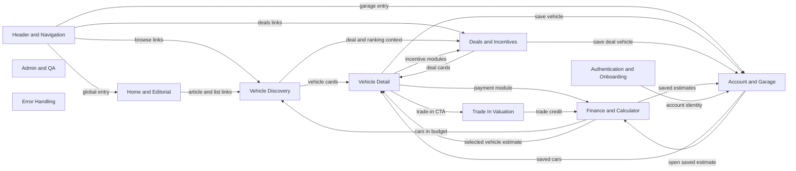

# CD MMP App Audit Map

This vault maps route families, shopper flows, and technical audit checkpoints for the marketplace app. Open this folder as an Obsidian vault, then use the local graph around module notes to see relationships.

## Start Here

- Use [[01 Route Inventory]] for the complete route table generated from `src/App.tsx`.
- Use [[02 Audit Runbook]] for QA commands and manual checks.
- Use [[Issues/00 QA Backlog]] to turn findings into tickets or implementation passes.

## Product Module Graph

## Route Family Preview

```mermaid
graph LR
  authentication_and_onboarding["Authentication and Onboarding"]
  route_1["/sign-in"]
  authentication_and_onboarding --> route_1
  route_2["/sign-up"]
  authentication_and_onboarding --> route_2
  route_3["/onboarding/step-1"]
  authentication_and_onboarding --> route_3
  route_4["/onboarding/step-2"]
  authentication_and_onboarding --> route_4
  route_5["/onboarding/results"]
  authentication_and_onboarding --> route_5
  home_and_editorial["Home and Editorial"]
  route_6["/"]
  home_and_editorial --> route_6
  route_7["/expert-reviews"]
  home_and_editorial --> route_7
  route_8["/news"]
  home_and_editorial --> route_8
  route_9["/news-stories"]
  home_and_editorial --> route_9
  route_10["/news/:slug"]
  home_and_editorial --> route_10
  route_11["/article/:slug"]
  home_and_editorial --> route_11
  route_12["/listicle/:slug"]
  home_and_editorial --> route_12
  vehicle_discovery["Vehicle Discovery"]
  route_13["/vehicles"]
  vehicle_discovery --> route_13
  route_14["/browse"]
  vehicle_discovery --> route_14
  route_15["/used-cars"]
  vehicle_discovery --> route_15
  route_16["/brands/toyota"]
  vehicle_discovery --> route_16
  route_17["/brands/honda"]
  vehicle_discovery --> route_17
  route_18["/brands/:brandSlug"]
  vehicle_discovery --> route_18
  route_19["/rankings"]
  vehicle_discovery --> route_19
  route_20["/rankings/:bodyStyle"]
  vehicle_discovery --> route_20
  vehicle_detail["Vehicle Detail"]
  route_64["/:year/:make/:model"]
  vehicle_detail --> route_64
  route_65["/:year/:make/:model/v1"]
  vehicle_detail --> route_65
  route_66["/:year/:make/:model/v2"]
  vehicle_detail --> route_66
  route_67["/:year/:make/:model/v3"]
  vehicle_detail --> route_67
  route_68["/:year/:make/:model/v4"]
  vehicle_detail --> route_68
  route_69["/:year/:make/:model/v5"]
  vehicle_detail --> route_69
  route_70["/:year/:make/:model/v10"]
  vehicle_detail --> route_70
  route_71["/:year/:make/:model/v1b"]
  vehicle_detail --> route_71
  deals_and_incentives["Deals and Incentives"]
  route_34["/deals"]
  deals_and_incentives --> route_34
  route_35["/deals/best-buying-deals"]
  deals_and_incentives --> route_35
  route_36["/deals/0-percent-apr"]
  deals_and_incentives --> route_36
  route_37["/deals/cash-back"]
  deals_and_incentives --> route_37
  route_38["/deals/zero-apr"]
  deals_and_incentives --> route_38
  route_39["/deals/cash-finance"]
  deals_and_incentives --> route_39
  route_40["/deals/lease"]
  deals_and_incentives --> route_40
  route_41["/deals/lease/:slug"]
  deals_and_incentives --> route_41
  finance_and_calculator["Finance and Calculator"]
  route_23["/financing"]
  finance_and_calculator --> route_23
  route_24["/payment-calculator"]
  finance_and_calculator --> route_24
  route_25["/auto-loan-calculator"]
  finance_and_calculator --> route_25
  route_26["/auto-loan-calculator/all-in-one"]
  finance_and_calculator --> route_26
  route_27["/auto-loan-calculator/all-in-one-budget"]
  finance_and_calculator --> route_27
  route_28["/auto-loan-calculator/light"]
  finance_and_calculator --> route_28
  route_29["/auto-loan-calculator/light-steps"]
  finance_and_calculator --> route_29
  route_30["/auto-loan-calculator/light-steps/:stepSlug"]
  finance_and_calculator --> route_30
  trade_in_valuation["Trade In Valuation"]
  route_53["/whats-my-car-worth"]
  trade_in_valuation --> route_53
  route_54["/whats-my-car-worth/results"]
  trade_in_valuation --> route_54
  route_55["/trade-in-value"]
  trade_in_valuation --> route_55
  route_56["/trade-in-value/results"]
  trade_in_valuation --> route_56
  account_and_garage["Account and Garage"]
  route_57["/account"]
  account_and_garage --> route_57
  admin_and_qa["Admin and QA"]
  route_58["/design-system"]
  admin_and_qa --> route_58
  route_59["/admin/vehicle-ratings"]
  admin_and_qa --> route_59
  route_60["/admin/feedback"]
  admin_and_qa --> route_60
  route_61["/audit/cards"]
  admin_and_qa --> route_61
  route_62["/audit/carousels"]
  admin_and_qa --> route_62
  route_63["/email-preview"]
  admin_and_qa --> route_63
  error_handling["Error Handling"]
  route_87["*"]
  error_handling --> route_87
```

## Core Flows

- [[Flows/Guided Calculator to Garage|Guided Calculator to Garage]]
- [[Flows/Vehicle Research to Finance|Vehicle Research to Finance]]
- [[Flows/Deals Discovery|Deals Discovery]]
- [[Flows/Trade-In to Budget|Trade-In to Budget]]
- [[Flows/Editorial to Shopping|Editorial to Shopping]]

## Module Notes

- [[Modules/Authentication and Onboarding|Authentication and Onboarding]]
- [[Modules/Home and Editorial|Home and Editorial]]
- [[Modules/Vehicle Discovery|Vehicle Discovery]]
- [[Modules/Vehicle Detail|Vehicle Detail]]
- [[Modules/Deals and Incentives|Deals and Incentives]]
- [[Modules/Finance and Calculator|Finance and Calculator]]
- [[Modules/Trade In Valuation|Trade In Valuation]]
- [[Modules/Account and Garage|Account and Garage]]
- [[Modules/Admin and QA|Admin and QA]]
- [[Modules/Error Handling|Error Handling]]
